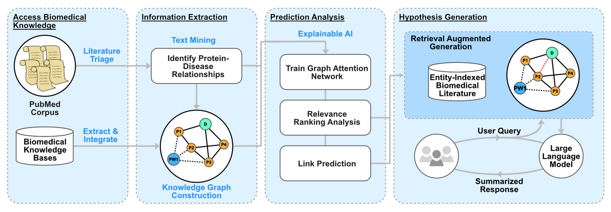

# Retrieval under Graph-guided Explainable Disease mechanisms (RUGGED)
This repository contains the code associated with the in-progress publication titled "Explainable Biomedical Hypothesis Generation via Retrieval Augmented Generation enabled Large Language Models" This software is designed to facilitate biomedical hypothesis generation by extracting information from biomedical literature and knowledge bases. It employs explainable AI predictions to derive interpretable and actionable insights from existing biomedical knowledge. The software streamlines exploration of knowledge graphs and AI-based predictions, using fine-tuned large language models (LLMs) to provide an intuitive and informative user experience.

This manuscript presents a comprehensive workflow designed to support basic science researchers hypothesis generation, pinpointing promising directions for wet-lab investigation. The figure below illustrates the workflow, beginning with accessing and processing biomedical knowledge from publications and knowledge bases. Using explainable AI, conduct a relevance ranking analysis on disease nodes and forecast potential links between proteins and diseases. These predictions, along with biomedical texts, are integrated into a framework that facilitates user-directed hypothesis generation through RAG-enabled LLMs. We anticipate this software will reduce hallucinations for LLM responses, provide interpretable and actionable predictions, while lowering the barrier to entry for bench scientists to use these cutting edge technologies.

**Figure 1.** Retrieval under Graph-guided Explainable Disease mechanisms (RUGGED) Workflow. RUGGED is comprised of four main components: 1) downloading and processing
data from ethically sourced and professionally managed resources (e.g., PubMed and various biomedical knowledgebases), 2) extracting information from peer-reviewed publications and assembling them into a knowledge graph, 3) identifying explainable predictions regarding the connections among biomedical entities within the knowledge graph (i.e., drug-protein relationships), and 4) a RAG-enabled large foundational framework to systematically connect ethically sourced and validated biomedical knowledge, literature, and predictions to enable enhanced exploration of biomedical hypotheses.

Docker: https://hub.docker.com/r/arpelletier/jove_llm

