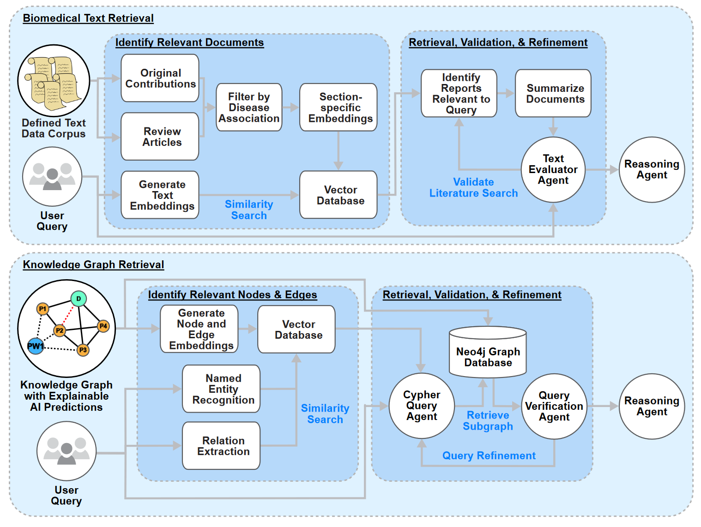

# Retrieval Under Graph-Guided Explainable disease Distinction (RUGGED)
This repository contains the code associated with the in-progress publication titled "Evidence-based Knowledge Synthesis and Hypothesis Validation: Navigating Biomedical Knowledge Bases via Explainable AI and Agentic Systems". This computational workflow integrates Large Language Model (LLM) inference with Retrieval Augmented Generation (RAG) drawing evidence from trustworthy and curated biomedical knowledge bases as well as peer reviewed biomedical text publications. This approach streamlines the identification of explainable and actionable predictions, synthesizing new knowledge from up-to-date information, to pinpoint promising directions for hypothesis-driven investigations.

For instructions on how to run this protocol, please visit the publication for more information: [doi: 10.3791/67525](https://dx.doi.org/10.3791/67525)

Alexander R. Pelletier, Joseph Ramirez, Baradwaj Simha Sankar, Irsyad Adam, Yu Yan, Dylan Steinecke, Wei Wang, Karol E. Watson, and Peipei Ping. Evidence-based knowledge synthesis and hypothesis validation: Navigating biomedical knowledge bases via explainable ai and agentic systems. Journal of visualized experiments: JoVE, doi: 10.3791/67525, 2025.

**Figure 1. Retrieval Under Graph-Guided Explainable disease Distinction (RUGGED) Workflow.** RUGGED consists of four primary components: (1) assembling and processing data from ethically sourced and professionally managed resources (e.g., PubMed and curated biomedical knowledge bases), (2) integrating peer-reviewed research findings into a unified knowledge graph, (3) structuring the text and graph data within database services, (4) modeling and predicting explainable relationships among biomedical entities within the knowledge graph, and (5) retrieving and synthesizing knowledge through a Retrieval Augmented Generation (RAG) workflow (Figure 2) to validate complex molecular relationships and explore AI-driven disease predictions. A human-in-the-loop review step can be conducted by the user to enhance the accuracy of the output.

**Figure 2. Retrieval architecture and bias mitigation workflow.** The Retrieval Augmented Generation (RAG) framework employs multiple LLM agents, each executing specific tasks to support access to relevant information based on the user query. This system provides documented evidence for the user-facing GPT-based Reasoning Agent, facilitating user-agent interaction and synthesis of knowledge. (1) Biomedical Text Retrieval: Peer-reviewed original contributions and review articles are filtered based on their relevance to understanding disease associations. A vector database is constructed for author and editor-validated text evidence weighted based on the corresponding section of the publication, respectively: 70% Abstract, 10% Results, 10% Metadata, and 10% for all other subsections. A keyword search and similarity search against the text embedding of the user query together identify relevant documents. Summaries of each document are generated using a BERT-based summarizer, with the GPT-based Text Evaluator Agent refining the search to validate query-document relevance. (2) Knowledge Graph Retrieval: A BERT-based named entity recognition and GPT-based relation extraction module connects the user query to relevant entities in the knowledge graph. A similarity search in a vector database identifies pertinent nodes and edges. Data is retrieved from the Neo4j database via Cypher queries generated by the GPT-based Cypher Query Agent and refined by the Query Verification Agent.

[Docker: https://hub.docker.com/repository/docker/pinglabutils/rugged/general](https://hub.docker.com/repository/docker/pinglabutils/rugged/general)
